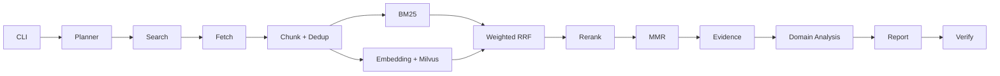

# RecResearcher

[English](README.md) | [简体中文](README.zh-CN.md)

[](https://github.com/yzy1147770433/rec-researcher/actions/workflows/ci.yml)
[](https://www.python.org/downloads/)
[](LICENSE)

RecResearcher is a lightweight research agent for recommender-system technical
investigation and paper-reproduction analysis. It turns a question into a
source-linked report through bounded asynchronous search, hybrid retrieval,
domain analysis, and deterministic citation validation.

The implementation uses a `src/` layout, Pydantic v2 models, Protocol-based
provider boundaries, and native `asyncio`. It does not depend on LangChain or
LangGraph. Mock mode and the default test suite need neither API keys nor a
network connection.

## Highlights

- The complete hybrid pipeline is available from the CLI: page fetch,
  extraction, chunking, deduplication, BM25, dense retrieval, weighted RRF,
  reranking, and MMR.
- Real mode combines an OpenAI-compatible LLM, Tavily search, SiliconFlow
  embeddings/reranking, and a Milvus Lite or in-memory vector index.
- Every claim input retains its passage ID, source ID, and source URL.
- Provider and source failures are isolated; one failed source does not abort a
  whole research run.
- Deterministic mock planner, search, fetch, embedding, reranking, and vector
  implementations make offline regression tests possible.
- Recommendation-specific analysis extracts model families, datasets, metrics,
  code links, hardware evidence, and reproduction risks.

## Architecture

The solid lines below are the current `rec-researcher run --retrieval-mode
hybrid` path. Snippet mode takes the direct `Search → Evidence` shortcut.



Planning and search tasks run with bounded `asyncio` concurrency, source and
task budgets, and timeouts. Each run persists its terminal state even when
individual tasks fail or the global deadline is reached.

## Installation

Python 3.11 or later and [uv](https://docs.astral.sh/uv/) are recommended.

```bash
git clone https://github.com/yzy1147770433/rec-researcher.git
cd rec-researcher
uv sync --all-groups
uv run rec-researcher doctor
```

## Quick Start

### Mock snippet

The default, deterministic path uses fictional offline fixtures:

```bash
uv run rec-researcher run \
  "How does generative retrieval differ from two-tower retrieval?" \
  --mode mock --retrieval-mode snippet
```

### Mock hybrid

This exercises fetch, chunking, BM25, mock dense retrieval, RRF, mock reranking,
and MMR without external services:

```bash
uv run rec-researcher run \
  "How does generative retrieval differ from two-tower retrieval?" \
  --mode mock --retrieval-mode hybrid
```

### Real snippet

Copy `.env.example` to `.env`, then configure the OpenAI-compatible LLM fields
and `REC_TAVILY_API_KEY`. Placeholder values below are configuration examples,
not usable credentials or claims about a real endpoint.

```dotenv
REC_LLM_BASE_URL=https://your-provider.invalid/v1
REC_LLM_API_KEY=replace-with-your-key
REC_LLM_MODEL=replace-with-your-model
REC_TAVILY_API_KEY=replace-with-your-key
```

```bash
uv run rec-researcher doctor --real
uv run rec-researcher run \
  "Representative work on generative retrieval for recommender systems" \
  --mode real --retrieval-mode snippet
```

### Real hybrid

In addition to the real snippet fields, configure the SiliconFlow provider and
models. Milvus Lite defaults to `./data/rec_researcher.db`.

```dotenv
REC_SILICONFLOW_API_KEY=replace-with-your-key
REC_EMBEDDING_MODEL=replace-with-your-embedding-model
REC_RERANKER_MODEL=replace-with-your-reranker-model
```

```bash
uv run rec-researcher run \
  "Representative work on generative retrieval for recommender systems" \
  --mode real --retrieval-mode hybrid \
  --embedding-provider siliconflow \
  --reranker-provider siliconflow \
  --vector-store milvus
```

Real runs make external requests and may incur provider charges. Search results,
page contents, latency, and generated text are not deterministic.

## Complete hybrid retrieval flow

1. **BM25** retrieves exact technical terms, model names, and dataset names.
   English uses word tokens; continuous Chinese text also uses character
   bigrams.
2. **Embedding + Milvus** embeds page chunks and the query, then performs cosine
   vector search. Mock mode uses deterministic embeddings and an in-memory
   index; real mode can select Milvus Lite or the in-memory index.
3. **Weighted RRF** merges lexical and dense ranks without treating their raw
   scores as directly comparable.
4. **Reranker** rescores the fused candidate texts against the question.
5. **MMR** selects a compact evidence set by balancing relevance, token-Jaccard
   redundancy, and a same-source penalty.

Degradation is explicit and recorded in run warnings. A failed or unusable page
falls back to its search snippet when available. Embedding or vector-index
failure keeps BM25 results; reranker failure keeps RRF order; MMR failure keeps
the preceding order. Empty search results, corpora, and reranker inputs are safe.

## Why this is a recommender-system research agent

RecResearcher performs domain analysis instead of only summarizing pages:

- It recognizes recommendation task and model categories, including recall,
  ranking, sequential recommendation, graph methods, and generative retrieval.
- It identifies named datasets and evaluation metrics such as Recall, NDCG,
  MRR, AUC, and LogLoss when they occur in the collected evidence.
- It matches GitHub repository URLs found in source material to the analyzed
  work; an absent link remains “not confirmed,” rather than being invented.
- Its reproduction-difficulty score uses visible rules for missing code/data,
  LLM training, distributed execution, and stated single-GPU feasibility, while
  retaining uncertainty when evidence is incomplete or contradictory.
- GPU and memory requirements may be reported only when supplied source records
  contain that evidence. The report prompt explicitly forbids unsupported GPU
  memory numbers.

These are evidence extraction heuristics, not a substitute for manual paper and
repository review.

## Run result examples

The repository includes a checked-in real-run snapshot. It is an example of the
artifact format, not a guaranteed result for a future run:

- [Sample report](docs/demo/sample-report.md)
- [Sample citation validation](docs/demo/sample-validation.json)
- [Sample run summary](docs/demo/sample-run-summary.json)

A normal run writes `report.md`, `sources.json`, `evidence.json`,
`validation.json`, and `run.json` under `outputs/<run-id>/`.

## Experiments and ablations

The checked-in benchmark outputs are
[the benchmark summary](docs/demo/sample-benchmark-summary.json) and the
[comparison table](docs/demo/sample-benchmark-comparison.md). They are snapshots
with their own recorded configuration and must not be generalized as performance
claims.

Run the offline smoke benchmark with:

```bash
uv run rec-researcher benchmark examples/bench/smoke5.jsonl \
  --mode mock --retrieval-mode snippet --max-concurrency 3

uv run rec-researcher benchmark examples/bench/smoke5.jsonl \
  --mode mock --retrieval-mode hybrid --max-concurrency 3
```

The evaluation library defines named stage ablations; the current CLI exposes
the snippet and complete hybrid configurations. Cases without human
`gold_source_ids` return `null` for judgment-dependent retrieval metrics rather
than manufacturing labels. See [evaluation methodology](docs/evaluation.md) and
[benchmark protocol](docs/benchmark-v0.2.md).

## Evidence and citation validation

```text
report claim [Sx] -> citation registry -> SourceRecord URL
                       ^
EvidenceRecord -> PassageRecord -> source_id
```

The verifier detects unknown or missing labels, numbering gaps, duplicate
references, uncited main sections, and URL/registry mismatches. A validation
result of `true` means these structural checks passed; it does not prove factual
truth, freshness, source quality, or source independence.

## Troubleshooting

### WSL with Clash Verge

WSL does not always inherit the Windows proxy automatically. Enable LAN access
in Clash Verge, determine the Windows host address visible from WSL, and export
both proxy variables for the current shell, using the port configured in Clash:

```bash
export HTTP_PROXY=http://<windows-host>:<proxy-port>
export HTTPS_PROXY=http://<windows-host>:<proxy-port>
```

Verify connectivity without printing secrets. If localhost forwarding is
enabled for your WSL setup, `127.0.0.1` may work; otherwise use the host address.

### `HTTPX ReadTimeout`

Increase the per-request timeout for a run and reduce concurrency if the proxy
or provider is slow:

```bash
uv run rec-researcher run "your question" --mode real \
  --retrieval-mode hybrid --timeout 60 \
  --retrieval-concurrency 2 --fetch-concurrency 2
```

### SiliconFlow HTTP 429

429 responses are retried up to `REC_MAX_RETRIES + 1` total attempts. Reduce
retrieval concurrency, wait for the rate-limit window, or check the account
quota. Do not repeatedly increase retries when the quota is exhausted.

### Milvus embedding dimension mismatch

A collection created for one embedding dimension cannot store another. Keep one
embedding model per collection, or select a new `REC_MILVUS_COLLECTION` (and, if
desired, a new `REC_MILVUS_URI`) after changing models. Do not reuse a collection
whose schema was created with a different dimension.

### Citation validation is `false`

Open the run's `validation.json` and inspect `errors`, then compare the report's
`[Sx]` labels and References URLs with `sources.json`. Real report generation
gets one citation-repair attempt; a remaining failure is preserved as a warning
instead of being hidden. Do not interpret `false` as a direct factual verdict.

## Development

```bash
uv run ruff check .
uv run pytest -q
uv build
```

Default tests exclude network and local-service integration markers. Network
tests require explicit credentials and opt-in selection with `-m network` or
`-m network_e2e`.

## Current limitations

- PDF extraction, tables, equations, appendices, and other structured document
  content have limited support; binary PDFs commonly fall back to snippets.
- Citation validation checks report structure and source mappings, not factual
  correctness, freshness, or source independence.
- Real network runs are non-deterministic and depend on provider availability,
  rate limits, search indexes, and mutable pages.
- The checked-in human benchmark is small, so its outputs are regression aids,
  not broad research-quality or performance claims.
- Rule-based recommendation-domain extraction can miss entities or associate
  them with the wrong work and still requires manual review.

## License

RecResearcher is available under the [MIT License](LICENSE).
