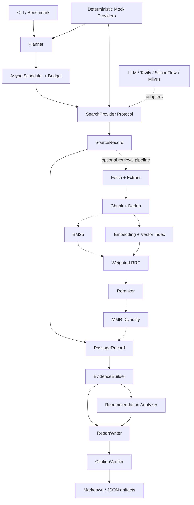

# RecResearcher

[](https://github.com/yzy1147770433/rec-researcher/actions/workflows/ci.yml)
[](https://www.python.org/downloads/)
[](LICENSE)

RecResearcher is a lightweight research agent for recommender-system technical
investigation and paper-reproduction analysis. It organizes question planning,
source retrieval, evidence binding, citation validation, domain analysis, and
offline evaluation into a testable Python workflow.

Its primary goal is to produce research reports whose claims can be traced back
to stable source identifiers and URLs, rather than returning an answer that
cannot be audited.

This is an independent implementation based on public technical ideas and this
repository's own requirements. It uses a `src/` layout, Pydantic v2 domain
models, Protocol-based provider boundaries, and native `asyncio` orchestration.
It does not depend on LangChain or LangGraph.

## Highlights

- Decomposes a research question into 3–5 bounded inquiry tasks.
- Enforces task, source, concurrency, retry, and timeout budgets.
- Includes deterministic offline planner, search, embedding, and reranker fakes.
- Supports OpenAI-compatible LLMs and Tavily search in real mode.
- Provides fetching, extraction, chunking, URL/text deduplication, BM25, vector
  retrieval, weighted RRF, reranking, and MMR components.
- Preserves passage, source identifier, and URL relationships in every evidence
  record.
- Assigns stable `[S1]` citations and validates citation continuity and URL
  consistency.
- Extracts recommender-system tasks, model families, datasets, metrics, GitHub
  links, and hardware evidence.
- Evaluates reproduction difficulty with transparent rules and preserves
  uncertainty when evidence is missing or conflicting.
- Isolates provider and source failures so one failure does not terminate an
  entire research run.
- Keeps network tests opt-in; the default suite requires neither API keys nor
  internet access.

## Architecture



Solid lines show the current `rec-researcher run` path. Dashed lines show
implemented and tested retrieval components that are not yet all connected to
the CLI workflow. Real runs currently build evidence from Tavily titles, URLs,
and snippets; they do not automatically run full-page fetching, Milvus,
SiliconFlow embeddings, and reranking in the same command.

## Research workflow

1. The CLI validates the selected mode and creates a `ResearchOrchestrator`.
2. The planner splits a non-empty question into bounded `InquiryTask` objects.
   The real planner gets one repair attempt when it returns invalid JSON.
3. The scheduler executes tasks with `asyncio`, a semaphore, a global timeout,
   and source budgets.
4. Each task queries a `SearchProvider`. A failed task records its error without
   cancelling independent tasks.
5. Search results become `SourceRecord` objects and source-linked passages.
6. `EvidenceBuilder` creates evidence that retains `source_id`, `passage_id`,
   excerpts, and relevance scores.
7. The domain analyzer extracts recommender-system entities and estimates
   reproduction difficulty.
8. The report writer receives only structured sources and evidence. Real-mode
   citation failures receive one repair attempt and are otherwise recorded as
   warnings.
9. Each run saves the report, sources, evidence, citation validation, task
   results, and budget metadata.

## Installation

Python 3.11 or later is required. [uv](https://docs.astral.sh/uv/) is the
recommended environment and package manager.

```bash
git clone https://github.com/yzy1147770433/rec-researcher.git
cd rec-researcher
uv sync --all-groups
uv run rec-researcher doctor
```

Mock mode works without configuration. To prepare real mode, copy the template:

```bash
cp .env.example .env
```

## Usage

### Offline mock run

Mock sources are deterministic, explicitly fictional fixtures intended for
testing and demonstrations.

```bash
uv run rec-researcher run \
  "How does generative retrieval differ from two-tower retrieval?" \
  --mode mock
```

### Real run

Configure an OpenAI-compatible LLM and Tavily in the untracked `.env` file:

```dotenv
REC_LLM_BASE_URL=https://your-llm-endpoint.example/v1
REC_LLM_API_KEY=your-secret
REC_LLM_MODEL=your-model
REC_TAVILY_API_KEY=your-secret
```

Then validate the configuration and start a run:

```bash
uv run rec-researcher doctor --real
uv run rec-researcher run \
  "Representative work on generative retrieval for recommender systems" \
  --mode real
```

Real mode accesses external services. Results can vary with model versions,
search indexes, page changes, rate limits, and provider availability.

### Offline benchmark

```bash
uv run rec-researcher benchmark examples/bench/smoke5.jsonl \
  --mode mock --max-concurrency 3
```

Cases without `gold_source_ids` report Recall@K and MRR as `null`; the runner
does not invent relevance labels. See [docs/evaluation.md](docs/evaluation.md)
for metric definitions.

### Demonstration script

```bash
bash examples/demo.sh
```

The script runs the local doctor, Ruff, default tests, and a mock example, then
prints the path of the latest generated report.

## Output artifacts

A normal run writes:

```text
outputs/<run-id>/
├── report.md
├── sources.json
├── evidence.json
├── validation.json
└── run.json
```

A benchmark writes:

```text
outputs/benchmarks/<benchmark-name>/
├── cases/<case-id>.json
├── runs/<case-id>/<run-id>/...
└── summary.json
```

Runtime artifacts are ignored by Git; only `outputs/.gitkeep` is tracked.

## Retrieval design

- **BM25** handles exact terms, model names, and dataset names. English text
  uses word tokens and continuous Chinese text uses character bigrams.
- **Vector retrieval** uses embeddings and Milvus Lite cosine search. A vector
  provider failure degrades safely to lexical retrieval.
- **Weighted RRF** combines ranked channels without comparing incompatible raw
  score scales.
- **Reranking** refines fused candidates. Failure preserves RRF order and adds
  a warning.
- **MMR** balances relevance with token-Jaccard redundancy and a same-source
  penalty.

Empty corpora, empty search results, and empty reranker documents are handled
safely.

## Evidence and citations

The traceability chain is:

```text
report claim [Sx] -> citation registry -> SourceRecord URL
                       ^
EvidenceRecord -> PassageRecord -> source_id
```

`CitationVerifier` detects unknown or missing labels, numbering gaps, duplicate
references, uncited main sections, and mismatches between cited URLs and source
records. Citation coverage measures structural validity; it does not prove that
a real-world claim is true.

## Development

Run formatting and static checks:

```bash
uv run ruff check .
```

Run the deterministic default suite:

```bash
uv run pytest
```

Milvus Lite tests bind a local socket and are kept in a separate integration
group:

```bash
uv run pytest tests/unit/test_vector_store.py -m integration
```

Network tests require explicit credentials and opt-in selection:

```bash
uv run pytest -m network
```

Build the wheel and source distribution:

```bash
uv build
```

## Secret handling

- Credentials come only from `REC_*` environment variables or a local `.env`.
- API keys use Pydantic `SecretStr`; safe summaries expose only whether they are
  configured.
- `.env`, database files, outputs, logs, and coverage data are ignored.
- Provider errors and logs must not expose authorization headers or complete
  secret values.

## Current limitations

- The CLI does not yet connect full-page fetching, chunking, BM25/vector
  retrieval, RRF, reranking, and MMR into one end-to-end run.
- Real mode currently combines only an OpenAI-compatible LLM and Tavily;
  SiliconFlow and Milvus Lite are not CLI-selectable end-to-end providers.
- Mock sources are regression fixtures and cannot evaluate real research
  quality.
- Rule-based domain extraction cannot replace manual paper review.
- Citation validation checks structure and mappings, not factual truth,
  freshness, or source independence.
- The five smoke benchmark cases do not contain human relevance judgments.

## Roadmap

- Connect the complete retrieval pipeline to the orchestrator.
- Expose embedding, reranker, and vector-index selection in the CLI.
- Add versioned benchmarks with human relevance judgments.
- Add structured PDF, table, and appendix extraction.
- Persist recommendation-paper profiles as independent artifacts.
- Improve budget, latency, and provider-degradation observability while
  preserving secret redaction.
- Expand opt-in end-to-end network tests and long-term regression baselines.

## License

RecResearcher is available under the [MIT License](LICENSE).
