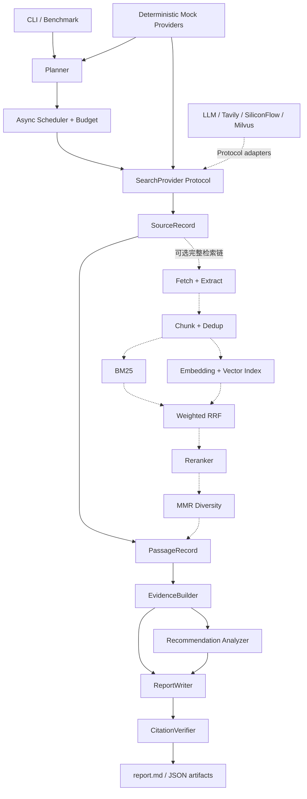

# RecResearcher

RecResearcher 是一个面向推荐系统技术调研与论文复现分析的轻量 Research
Agent。它将问题规划、来源检索、证据绑定、引用校验、推荐领域分析和离线评测组织为
可测试的 Python 工作流，目标是生成能够追溯到来源 URL 的研究报告，而不是只返回一段
无法核验的模型回答。

本项目不是原 DeepResearch 仓库的复制，也不引用其源码、测试、提示词、Schema、配置
结构或文档措辞。核心代码基于本仓库需求独立设计和实现，采用 `src/` 布局、Pydantic
v2 领域模型、Protocol 外部接口与原生 `asyncio` 编排；不依赖 LangChain 或
LangGraph。

## 功能列表

- 将研究问题拆成 3–5 个有界任务，并限制任务数、来源数、并发量和超时。
- 提供完全离线、确定性的 Mock Planner、Search、Embedding 和 Reranker。
- Real 模式接入 OpenAI-compatible LLM 与 Tavily 搜索，缺少配置时明确失败。
- 提供网页抓取、正文提取、分块、URL/文本去重等独立检索组件。
- 提供 BM25、向量召回、加权 RRF、Reranker、MMR 混合检索管线。
- Evidence 保留 passage、source、URL 的可追溯关系。
- 报告使用稳定的 `[S1]` 编号，并执行引用存在性、连续性和 URL 一致性校验。
- 识别推荐系统任务、模型家族、数据集、指标、GitHub 地址和硬件证据。
- 使用透明规则评估论文复现难度；没有显存证据时保持 `unknown`/`null`。
- 提供失败隔离的 Mock benchmark 和不伪造 Recall@K/MRR 的轻量评测。
- 默认测试不需要 API Key 或互联网；真实网络测试必须显式启用。

## 架构



实线表示当前 `rec-researcher run` 主流程，虚线表示已经实现并有单元测试、但尚未全部
接入 CLI 主流程的完整网页与混合检索组件。这个区别很重要：当前 Real 主流程使用
Tavily 返回的标题、URL 和 snippet 构建证据，还没有自动把网页抓取、Milvus、
SiliconFlow Embedding/Reranker 串入同一次运行。

## Planner 到 Report 的完整流程

1. CLI 校验模式和配置，创建 `ResearchOrchestrator`。
2. Planner 将非空问题拆成 3–5 个 `InquiryTask`；Real Planner 对无效 JSON 最多修复
   一次。
3. Scheduler 使用 `asyncio` 和 semaphore 执行任务，应用全局超时、并发与来源预算。
4. 每个任务通过 `SearchProvider` 查询来源。单个任务失败会写入 `TaskResult.errors`，
   不会取消其他独立任务。
5. 来源被规范化为 `SourceRecord`。当前主流程从 snippet 产生 source-linked
   `PassageRecord`；完整检索组件还可以执行抓取、分块、混合召回和多样性选择。
6. `EvidenceBuilder` 生成 `EvidenceRecord`，同时保存 `source_id`、`passage_id`、摘录
   和相关性分数。
7. 推荐领域分析器从来源和证据中提取任务、模型、数据集、指标、代码地址、硬件证据
   与可解释复现难度。
8. Report Writer 只接收结构化来源和 Evidence。Real Writer 生成报告后执行本地引用
   校验，失败时最多修复一次；修复仍失败则保留原报告并记录 warning。
9. 每次运行保存 Markdown、来源、证据、引用校验和完整运行元数据。

## 混合检索原理

### BM25

BM25 是稀疏词项检索。它根据查询词在文档中的出现频率、词的全局稀有程度和文档
长度归一化计算相关性。项目对英文使用词级 token，对连续中文使用字符 bigram，适合
精确术语、模型名和数据集名检索。空语料或空查询会安全返回空列表。

### 向量召回

向量召回将 passage 和 query 映射到同一向量空间，再通过 Milvus Lite 以余弦相似度
查找近邻。它能够召回字面词不同但语义接近的内容。Embedding 和向量数据库被隔离在
Protocol 后；维度不一致会明确报错，外部服务失败时检索管线退化到 BM25。

### RRF

Reciprocal Rank Fusion 不直接比较不同检索器的原始分数，而按排名融合：

```text
score(d) = Σ_channel weight(channel) / (rrf_k + rank(channel, d))
```

这样可以稳定合并 BM25 与向量召回，即使两者分数尺度不同。实现会去除同一通道内的
重复 passage，并保留 lexical/vector rank 以便追踪。

### Reranker

Reranker 对 RRF 候选进行更精细的 query-document 相关性判断，并返回原输入索引与
相关性分数。当前提供 SiliconFlow 适配器及确定性 fake。Reranker 失败时保留 RRF
顺序并写入降级 warning，不会使整个研究运行终止。

### MMR

Maximal Marginal Relevance 同时考虑相关性和已选内容的冗余：

```text
MMR = lambda * relevance - (1 - lambda) * max_similarity - source_penalty
```

项目使用 token Jaccard 相似度衡量文本重复，并对同源 passage 增加惩罚，从而避免
最终证据被同一网页或高度相似段落占满。

## Evidence 与 Citation 设计

`SourceRecord` 保存稳定来源 ID、标题、URL、snippet 和 provider；`PassageRecord`
保存文本位置与 `source_id`；`EvidenceRecord` 再绑定 `source_id`、`passage_id`、摘录和
claim hint。生成的事实主张因此能够沿以下链路回溯：

```text
report claim [Sx] -> citation registry -> SourceRecord URL
                       ^
EvidenceRecord -> PassageRecord -> source_id
```

`CitationRegistry` 按唯一 URL 分配连续的 `[S1]`、`[S2]` 标签。`CitationVerifier`
检查未知标签、`[S0]`、编号断档、重复 References、正文引用缺失、引用 URL 与来源不一致
以及主要章节是否包含引用。引用覆盖率是结构校验指标，不代表论断在现实中一定正确。

## 推荐系统专属能力

`RecommendationDomainAnalyzer` 能够从已有来源和 Evidence 中识别：

- 召回、排序、多任务学习、序列推荐、图推荐、生成式推荐；
- ItemCF、双塔、DeepFM、DIN、MMOE、GNN、Transformer、Semantic ID、
  Autoregressive Generation；
- MovieLens、Amazon Reviews、Criteo、MIND、KuaiRec 等常见数据集；
- Recall、NDCG、Hit Rate、MRR、AUC、LogLoss；
- GitHub URL、公开代码状态和明确写出的硬件要求。

复现难度只使用公开、可解释的加减分规则。显存数值仅在来源明确说明时提取；无证据
时为 `null`，冲突证据进入 `uncertainty`。报告固定包含“论文与代码对照”“数据集与
指标”“复现难度分析”“三天复现建议”四个领域章节。

## 安装

要求 Python 3.11 或更高版本，并推荐使用 uv：

```bash
git clone <your-rec-researcher-repository-url>
cd rec-researcher
uv sync --all-groups
uv run rec-researcher doctor
```

配置模板：

```bash
cp .env.example .env
```

Mock 模式不需要创建 `.env`。

## 运行

### Mock 模式

Mock 模式完全离线，来源是明确标注为 fictional 的固定夹具：

```bash
uv run rec-researcher run "生成式推荐与双塔召回有什么区别？" --mode mock
```

### Real 模式

先在未跟踪的 `.env` 中配置 OpenAI-compatible LLM 和 Tavily：

```dotenv
REC_LLM_BASE_URL=https://your-llm-endpoint.example/v1
REC_LLM_API_KEY=your-secret
REC_LLM_MODEL=your-model
REC_TAVILY_API_KEY=your-secret
```

检查配置并运行：

```bash
uv run rec-researcher doctor --real
uv run rec-researcher run "推荐系统生成式召回的代表工作" --mode real
```

Real 模式会访问外部服务，结果受网页、搜索索引、模型版本和服务状态影响。

### Benchmark

```bash
uv run rec-researcher benchmark examples/bench/smoke5.jsonl \
  --mode mock --max-concurrency 3
```

Mock benchmark 用于离线回归。没有 `gold_source_ids` 的 case，其 Recall@K 和 MRR
严格输出 `null`。指标定义见 [docs/evaluation.md](docs/evaluation.md)。

### 一键演示

```bash
bash examples/demo.sh
```

脚本依次运行 doctor、Ruff、默认 Pytest 和 Mock 示例，最后打印最新
`report.md` 路径。

## 输出目录

普通运行默认写入：

```text
outputs/<run-id>/
├── report.md          # 最终 Markdown 报告
├── sources.json       # 来源及稳定 ID/URL
├── evidence.json      # passage/source-linked Evidence
├── validation.json    # 引用校验结果与覆盖率
└── run.json           # 任务、统计、预算、限制和完整输出
```

Benchmark 默认写入：

```text
outputs/benchmarks/<benchmark-name>/
├── cases/<case-id>.json
├── runs/<case-id>/<run-id>/...
└── summary.json
```

运行产物不会被 Git 跟踪；仓库只保留 `outputs/.gitkeep`。

## API Key 安全

- 凭据只通过 `REC_*` 环境变量或本地 `.env` 注入，不硬编码到代码。
- API Key 使用 Pydantic `SecretStr`，`safe_summary()` 只返回是否配置的布尔值。
- `.env`、所有数据库文件、运行输出、日志和 coverage 文件均在 `.gitignore` 中。
- 代码不记录请求 header、`Authorization` 或完整 secret。
- Provider 错误不得包含请求凭据；提交前仍应检查 Git diff，避免把终端输出或真实响应
  手工复制进文档。

## 当前限制

- CLI 主流程尚未串联网页全文抓取、分块、BM25/向量召回、RRF、Reranker 和 MMR；
  这些组件目前作为独立、已测试的检索管线存在。
- Real 模式当前只组合 OpenAI-compatible LLM 与 Tavily；SiliconFlow 和 Milvus Lite
  尚未成为 CLI 可选的端到端配置。
- Mock 来源是回归夹具，不是真实论文，不能用于评价真实研究结论质量。
- 规则式推荐领域分析依赖证据中的明确词语，不能替代人工论文审阅。
- 引用校验验证结构和映射关系，不验证网页内容是否真实、最新或互相独立。
- Benchmark 的五个 smoke case 没有人工 gold relevance，因此不计算 Recall@K/MRR。
- 实时网页搜索不完全确定；网页更新、排序变化、限流和模型输出都会影响结果。

## 路线图

- 将 Fetch、Chunk、Dedup、BM25、向量召回、RRF、Reranker、MMR 接入主编排流程。
- 在 CLI 中显式选择 Embedding、Reranker 和 VectorIndex provider，并管理其生命周期。
- 增加带人工 relevance judgment 的版本化 benchmark，报告可信 Recall@K/MRR。
- 增加论文 PDF、表格和附录的结构化解析与跨来源冲突展示。
- 将推荐论文画像持久化为独立 artifact，并在报告中提供证据级字段引用。
- 增加预算、延迟和 provider 降级的可观测性，同时保证 secret redaction。
- 扩展 opt-in 的真实端到端测试和长期回归基线。
