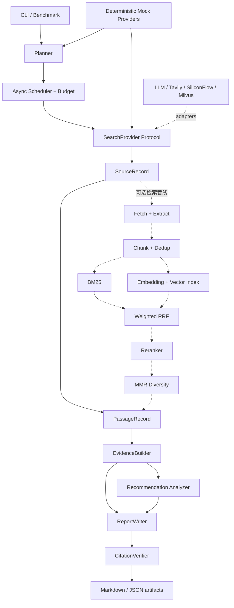

# RecResearcher

[English](README.md) | [简体中文](README.zh-CN.md)

[](https://github.com/yzy1147770433/rec-researcher/actions/workflows/ci.yml)
[](https://www.python.org/downloads/)
[](LICENSE)

RecResearcher 是一个面向推荐系统技术调研与论文复现分析的轻量 Research Agent。它将
问题规划、来源检索、证据绑定、引用校验、领域分析和离线评测组织成可测试的 Python
工作流。

项目的主要目标是生成可沿稳定来源标识和 URL 回溯的研究报告，而不是只返回一段无法
审计的模型回答。

本项目基于公开技术思想和本仓库自身需求独立实现，采用 `src/` 布局、Pydantic v2
领域模型、Protocol Provider 边界与原生 `asyncio` 编排，不依赖 LangChain 或
LangGraph。

## 核心特性

- 将研究问题拆成 3–5 个有界调研任务。
- 限制任务数、来源数、并发量、重试次数和超时时间。
- 提供确定性的离线 Planner、Search、Embedding 和 Reranker Fake。
- Real 模式支持 OpenAI-compatible LLM 与 Tavily 搜索。
- 提供网页抓取、正文提取、分块、URL/文本去重、BM25、向量召回、加权 RRF、
  Reranker 和 MMR 组件。
- 每条证据均保留 passage、source ID 和 URL 关系。
- 使用稳定的 `[S1]` 引用编号，并验证编号连续性和 URL 一致性。
- 识别推荐系统任务、模型家族、数据集、指标、GitHub 地址和硬件证据。
- 使用透明规则评估复现难度；证据缺失或冲突时保留不确定性。
- 隔离 Provider 和单个来源失败，避免一次失败终止整个调研任务。
- 网络测试默认关闭；默认测试不需要 API Key 或互联网。

## 架构



实线表示当前 `rec-researcher run` 的主流程，虚线表示已经实现并有测试、但尚未全部接入
CLI 的检索组件。Real 模式目前使用 Tavily 返回的标题、URL 和 snippet 构建证据，尚未
在同一次命令中自动执行网页全文抓取、Milvus、SiliconFlow Embedding 和 Reranker。

## 调研流程

1. CLI 校验运行模式并创建 `ResearchOrchestrator`。
2. Planner 将非空问题拆成有界的 `InquiryTask`。Real Planner 返回无效 JSON 时允许
   修复一次。
3. Scheduler 使用 `asyncio`、semaphore、全局超时和来源预算执行任务。
4. 每个任务调用 `SearchProvider`。失败任务记录错误，但不会取消其他独立任务。
5. 搜索结果转换为 `SourceRecord` 和与来源绑定的 passage。
6. `EvidenceBuilder` 生成保留 `source_id`、`passage_id`、摘录和相关性分数的证据。
7. 领域分析器提取推荐系统实体并评估复现难度。
8. Report Writer 只接收结构化来源和证据。Real 模式引用校验失败时允许修复一次，
   再次失败则记录 warning。
9. 每次运行保存报告、来源、证据、引用校验、任务结果和预算元数据。

## 安装

项目要求 Python 3.11 或更高版本，推荐使用
[uv](https://docs.astral.sh/uv/) 管理环境和依赖。

```bash
git clone https://github.com/yzy1147770433/rec-researcher.git
cd rec-researcher
uv sync --all-groups
uv run rec-researcher doctor
```

Mock 模式无需配置。使用 Real 模式前，先复制配置模板：

```bash
cp .env.example .env
```

## 使用方法

### 离线 Mock 运行

Mock 来源是确定性、明确标记为虚构的测试夹具，用于测试和演示。

```bash
uv run rec-researcher run \
  "生成式推荐与双塔召回有什么区别？" \
  --mode mock
```

### Real 模式

在不被 Git 跟踪的 `.env` 中配置 OpenAI-compatible LLM 和 Tavily：

```dotenv
REC_LLM_BASE_URL=https://your-llm-endpoint.example/v1
REC_LLM_API_KEY=your-secret
REC_LLM_MODEL=your-model
REC_TAVILY_API_KEY=your-secret
```

然后检查配置并启动任务：

```bash
uv run rec-researcher doctor --real
uv run rec-researcher run \
  "推荐系统生成式召回的代表工作" \
  --mode real
```

Real 模式会访问外部服务，结果可能受模型版本、搜索索引、页面更新、限流和 Provider
可用性影响。

### 离线 Benchmark

```bash
uv run rec-researcher benchmark examples/bench/smoke5.jsonl \
  --mode mock --max-concurrency 3
```

没有 `gold_source_ids` 的 case，其 Recall@K 和 MRR 会严格输出 `null`，评测器不会伪造
相关性标签。指标定义见 [docs/evaluation.md](docs/evaluation.md)。

### 一键演示

```bash
bash examples/demo.sh
```

脚本依次运行本地 doctor、Ruff、默认测试和 Mock 示例，最后打印最新报告的路径。

## 输出产物

普通运行输出：

```text
outputs/<run-id>/
├── report.md
├── sources.json
├── evidence.json
├── validation.json
└── run.json
```

Benchmark 输出：

```text
outputs/benchmarks/<benchmark-name>/
├── cases/<case-id>.json
├── runs/<case-id>/<run-id>/...
└── summary.json
```

运行产物不会被 Git 跟踪；仓库只保留 `outputs/.gitkeep`。

## 检索设计

- **BM25**：用于召回精确术语、模型名和数据集名。英文使用词级 token，连续中文使用
  字符 bigram。
- **向量召回**：使用 Embedding 和 Milvus Lite 余弦相似度搜索。向量 Provider 失败时
  安全降级到稀疏检索。
- **加权 RRF**：融合不同召回通道的排名，无需比较尺度不一致的原始分数。
- **Reranker**：精排融合后的候选。失败时保留 RRF 顺序并记录 warning。
- **MMR**：结合相关性、token Jaccard 冗余度和同源惩罚选择多样化证据。

空语料、空搜索结果和空 Reranker 文档均会被安全处理。

## Evidence 与 Citation

证据追溯链路如下：

```text
report claim [Sx] -> citation registry -> SourceRecord URL
                       ^
EvidenceRecord -> PassageRecord -> source_id
```

`CitationVerifier` 能够识别未知或缺失标签、编号断档、重复 References、主要章节缺少
引用，以及引用 URL 与来源记录不一致。引用覆盖率只衡量结构有效性，并不证明现实主张
一定真实。

## 开发与测试

运行静态检查：

```bash
uv run ruff check .
```

运行确定性的默认测试：

```bash
uv run pytest
```

Milvus Lite 测试需要绑定本机 socket，因此单独归入集成测试：

```bash
uv run pytest tests/unit/test_vector_store.py -m integration
```

网络测试需要显式配置凭据并主动选择：

```bash
uv run pytest -m network
```

构建 wheel 和源码包：

```bash
uv build
```

## Secret 安全

- 凭据只从 `REC_*` 环境变量或本地 `.env` 读取。
- API Key 使用 Pydantic `SecretStr`；安全摘要只显示是否已配置。
- `.env`、数据库、运行输出、日志和 coverage 文件均被忽略。
- Provider 错误和日志不得暴露 Authorization header 或完整 secret。

## 当前限制

- CLI 尚未将网页全文抓取、分块、BM25/向量召回、RRF、Reranker 和 MMR 全部接入
  同一次端到端运行。
- Real 模式目前只组合 OpenAI-compatible LLM 与 Tavily；SiliconFlow 和 Milvus Lite
  尚未成为 CLI 可选的端到端 Provider。
- Mock 来源是回归夹具，不能用于评价真实研究质量。
- 规则式领域抽取不能替代人工论文审阅。
- 引用校验只验证结构和映射，不验证事实真实性、时效性或来源独立性。
- 五个 smoke benchmark case 没有人工 relevance judgment。

## 路线图

- 将完整检索管线接入 Orchestrator。
- 在 CLI 中支持选择 Embedding、Reranker 和 Vector Index。
- 增加带人工 relevance judgment 的版本化 Benchmark。
- 增加论文 PDF、表格和附录的结构化解析。
- 将推荐论文画像保存为独立 artifact。
- 在保证 secret 脱敏的前提下改进预算、延迟和 Provider 降级可观测性。
- 扩展 opt-in 端到端网络测试和长期回归基线。

## 许可证

RecResearcher 使用 [MIT License](LICENSE)。
