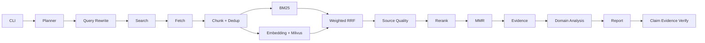

# RecResearcher

[English](README.md) | [简体中文](README.zh-CN.md)

[](https://github.com/yzy1147770433/rec-researcher/actions/workflows/ci.yml)
[](https://www.python.org/downloads/)
[](LICENSE)

RecResearcher 是一个面向推荐系统、搜索算法和大模型领域的可验证 Deep Research Agent。它通过
有界异步搜索、混合检索、领域分析和确定性引用校验，将研究问题转换为来源可追溯的报告。

项目采用 `src/` 布局、Pydantic v2 模型、Protocol Provider 边界和原生
`asyncio`，不依赖 LangChain 或 LangGraph。Mock 模式和默认测试无需 API Key 或网络。

## 核心特性

- CLI 已接入完整 hybrid pipeline：网页抓取、正文提取、分块、去重、BM25、稠密召回、
  加权 RRF、Reranker 和 MMR。
- Real 模式可组合 OpenAI-compatible LLM、Tavily、SiliconFlow Embedding/Reranker，
  以及 Milvus Lite 或内存向量索引。
- 每条报告输入证据都保留 passage ID、source ID 和来源 URL。
- 单个 Provider 或来源失败不会终止整个研究运行。
- 提供确定性的 Mock Planner、Search、Fetcher、Embedding、Reranker 和向量索引，便于
  离线回归测试。
- 面向推荐系统识别模型类别、数据集、指标、代码地址、硬件证据和复现风险。

## 架构

下图实线是当前 `rec-researcher run --retrieval-mode hybrid` 的真实执行路径；snippet
模式使用 `Search → Evidence` 的直接路径。



Planner 和 Search 使用有界 `asyncio` 并发，并受任务数、来源数和超时预算约束。即使
部分任务失败或触发全局超时，运行也会持久化终态。

## 安装

项目要求 Python 3.11 或更高版本，推荐使用
[uv](https://docs.astral.sh/uv/) 管理环境和依赖。

```bash
git clone https://github.com/yzy1147770433/rec-researcher.git
cd rec-researcher
uv sync --all-groups
uv run rec-researcher doctor
```

## Quick Start

### Mock snippet

默认路径使用确定性、明确为虚构内容的离线夹具：

```bash
uv run rec-researcher run \
  "生成式推荐与双塔召回有什么区别？" \
  --mode mock --retrieval-mode snippet
```

### Mock hybrid

无需外部服务即可执行抓取、分块、BM25、Mock 稠密召回、RRF、Mock Reranker 和 MMR：

```bash
uv run rec-researcher run \
  "生成式推荐与双塔召回有什么区别？" \
  --mode mock --retrieval-mode hybrid
```

### Real snippet

将 `.env.example` 复制为 `.env`，配置 OpenAI-compatible LLM 和
`REC_TAVILY_API_KEY`。以下内容只是配置占位符，不是真实凭据或真实服务地址。

```dotenv
REC_LLM_BASE_URL=https://your-provider.invalid/v1
REC_LLM_API_KEY=replace-with-your-key
REC_LLM_MODEL=replace-with-your-model
REC_TAVILY_API_KEY=replace-with-your-key
```

```bash
uv run rec-researcher doctor --real
uv run rec-researcher run \
  "推荐系统生成式召回的代表工作" \
  --mode real --retrieval-mode snippet
```

### Real hybrid

除 Real snippet 的字段外，还要配置 SiliconFlow 和两个模型。Milvus Lite 默认使用
`./data/rec_researcher.db`。

```dotenv
REC_SILICONFLOW_API_KEY=replace-with-your-key
REC_EMBEDDING_MODEL=replace-with-your-embedding-model
REC_RERANKER_MODEL=replace-with-your-reranker-model
```

```bash
uv run rec-researcher run \
  "推荐系统生成式召回的代表工作" \
  --mode real --retrieval-mode hybrid \
  --embedding-provider siliconflow \
  --reranker-provider siliconflow \
  --vector-store milvus
```

Real 模式会发起外部请求，并可能产生 Provider 费用。搜索结果、网页内容、延迟和生成文本
均不确定。

## 完整混合检索流程

1. **BM25** 召回精确技术术语、模型名和数据集名；英文使用词级 token，连续中文还使用
   字符 bigram。
2. **Embedding + Milvus** 分别编码网页 chunk 和 query，再执行余弦向量检索。Mock
   模式使用确定性 Embedding 和内存索引；Real 模式可选 Milvus Lite 或内存索引。
3. **Weighted RRF** 融合稀疏和稠密排名，不直接比较尺度不同的原始分数。
4. **Reranker** 根据研究问题重新评估融合后的候选文本。
5. **MMR** 综合相关性、token Jaccard 冗余度和同源惩罚，选择紧凑而多样的证据集。

所有降级都会写入运行 warning。页面抓取失败或正文不可用时，若有搜索 snippet 则回退到
snippet；Embedding 或向量索引失败时保留 BM25；Reranker 失败时保留 RRF 顺序；MMR
失败时保留上一阶段顺序。空搜索结果、空语料和空 Reranker 输入均会安全处理。

## 为什么这是推荐系统专属研究 Agent

RecResearcher 不只是汇总网页，还会执行推荐系统领域分析：

- 识别召回、排序、序列推荐、图方法、生成式召回等任务和模型类别。
- 从已收集证据中识别数据集，以及 Recall、NDCG、MRR、AUC、LogLoss 等指标。
- 将来源材料中出现的 GitHub 仓库 URL 与被分析工作匹配；没有证据时保留“未确认公开
  代码”，不会编造链接。
- 通过可见规则评估复现难度：缺少代码/数据、LLM 训练、分布式运行会增加难度，明确的
  单卡可行性会降低难度；证据缺失或冲突时保留不确定性。
- 只有来源记录实际包含相关证据时才报告 GPU 和显存要求；报告提示明确禁止生成无来源的
  GPU 显存数字。

这些能力是基于证据的抽取规则，不能替代人工阅读论文和代码仓库。

## 运行结果示例

仓库保留了一份真实运行快照。它用于展示产物格式，不保证未来运行得到相同结果：

- [示例报告](docs/demo/sample-report.md)
- [示例引用校验](docs/demo/sample-validation.json)
- [示例运行摘要](docs/demo/sample-run-summary.json)

普通运行会在 `outputs/<run-id>/` 下写入 `report.md`、`sources.json`、`evidence.json`、
`claim-verification.json`、`validation.json` 和 `run.json`。

## 实验与消融

仓库中已有的 benchmark 输出包括
[汇总 JSON](docs/demo/sample-benchmark-summary.json)和
[对比表](docs/demo/sample-benchmark-comparison.md)。这些文件是带有自身运行配置的快照，
不能外推为性能结论。

运行离线 smoke benchmark：

```bash
uv run rec-researcher benchmark examples/bench/smoke5.jsonl \
  --mode mock --retrieval-mode snippet --max-concurrency 3

uv run rec-researcher benchmark examples/bench/smoke5.jsonl \
  --mode mock --retrieval-mode hybrid_rerank_mmr --max-concurrency 3
```

CLI 支持 `snippet`、`bm25_only`、`dense_only`、`hybrid_rrf`、
`hybrid_rerank` 和 `hybrid_rerank_mmr` 六种真实阶段配置；`hybrid` 保留为完整链路别名。
Benchmark 会输出 JSON、CSV 和 Markdown，并支持 `--resume`。没有人工
`gold_source_ids` 的 case 会将依赖相关性标注的指标写为 `null`，不会制造标签。详见
[评测方法](docs/evaluation.md)和 [benchmark 协议](docs/benchmark-v0.2.md)。

统一运行六种消融：

```bash
uv run rec-researcher ablate examples/bench/research30.v1.jsonl \
  --mock --concurrency 3 --output-dir outputs/ablations/research30
```

`--config` 支持 JSON/TOML，`--mock`、`--concurrency` 和根级
`--benchmark PATH` 是兼容入口。设置 `REC_CLAIM_VERIFIER=llm` 可启用单次批量
LLM entailment；超时、解析错误或 Provider 失败会回退到确定性校验。

Benchmark 同时报告严格 URL 指标和 Document Identity 指标。后者通过 DOI、arXiv ID、
预先标注的 URL aliases 与保守的长标题匹配识别同一论文，并按最终 Evidence 来源顺序
计算。真实搜索仅对明确的论文/DOI 查询启用可失败降级的 Crossref 通道。

## Evidence 与 Citation 校验

```text
report claim [Sx] -> citation registry -> SourceRecord URL
                       ^
EvidenceRecord -> PassageRecord -> source_id
```

校验器检查未知或缺失编号、编号断档、重复 References、主要章节无引用，以及 URL 与来源
注册表不一致。Claim-level 校验器另行输出 `supported`、`partially_supported`、
`unsupported`、`missing_citation` 和 `invalid_citation`。当前词项支持判断可审计，但
不等于事实真实性或时效性证明。

## Troubleshooting

### WSL + Clash Verge

WSL 不一定自动继承 Windows 代理。先在 Clash Verge 中允许局域网连接，确认 WSL 可访问的
Windows 主机地址，再按 Clash 实际端口为当前 shell 设置：

```bash
export HTTP_PROXY=http://<windows-host>:<proxy-port>
export HTTPS_PROXY=http://<windows-host>:<proxy-port>
```

检查连通性时不要打印 secret。如果当前 WSL 配置支持 localhost 转发，可以尝试
`127.0.0.1`；否则使用主机地址。

### `HTTPX ReadTimeout`

代理或 Provider 较慢时，可以增大单次请求超时并降低检索并发：

```bash
uv run rec-researcher run "你的问题" --mode real \
  --retrieval-mode hybrid --timeout 60 \
  --retrieval-concurrency 2 --fetch-concurrency 2
```

### SiliconFlow HTTP 429

429 会重试，最多执行 `REC_MAX_RETRIES + 1` 次请求。应降低检索并发、等待限流窗口，或
检查账户额度。额度耗尽时不要反复增加重试次数。

### Milvus 维度不一致

按某个 Embedding 维度创建的 collection 不能存储另一种维度。每个 collection 固定使用
一个 Embedding 模型；切换模型后应设置新的 `REC_MILVUS_COLLECTION`，必要时也设置新的
`REC_MILVUS_URI`，不要复用旧维度 schema。

### citation validation 为 `false`

打开当前运行的 `validation.json` 查看 `errors`，再将报告中的 `[Sx]` 和 References URL
与 `sources.json` 对照。Real Report 会自动尝试一次引用修复；仍失败时会保留 warning，
不会隐藏问题。`false` 不是对报告事实真假的直接判断。

## 开发与验证

```bash
uv run ruff check .
uv run pytest -q
uv build
```

默认测试排除网络和本地服务集成 marker。网络测试必须配置凭据，并使用 `-m network` 或
`-m network_e2e` 显式启用。

## 当前限制

- 文本 PDF 按页抽取，HTML 标题与表格尽量保留为 Markdown；扫描 PDF、复杂公式和版面
  重建仍可能降级到 snippet。
- Claim 校验支持可选的批量 LLM entailment，并保留确定性离线实现作为失败降级。
- 真实网络运行非确定性，受 Provider 可用性、限流、搜索索引和网页变化影响。
- 仓库中的人工 benchmark 规模较小，其输出只适合回归参考，不能代表广泛的研究质量或
  性能结论。
- 基于规则的推荐系统实体抽取可能漏识别或错误关联，仍需人工复核。

## License

RecResearcher 使用 [MIT License](LICENSE)。
